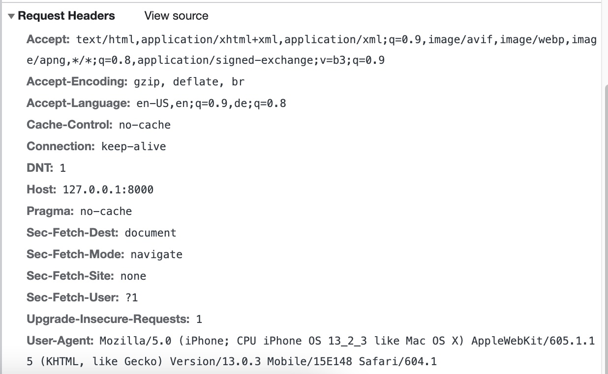
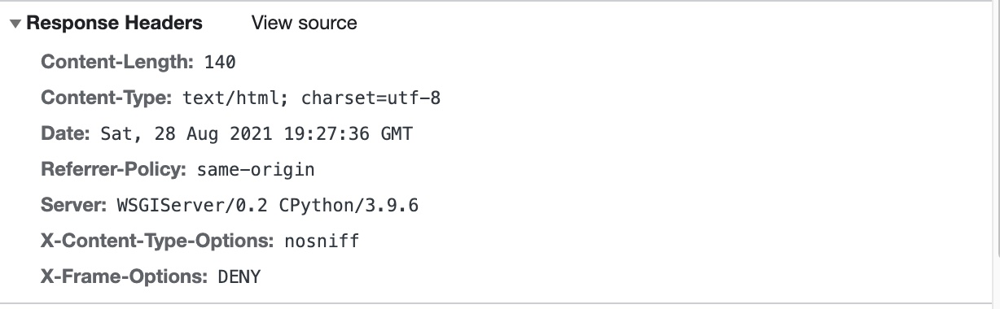
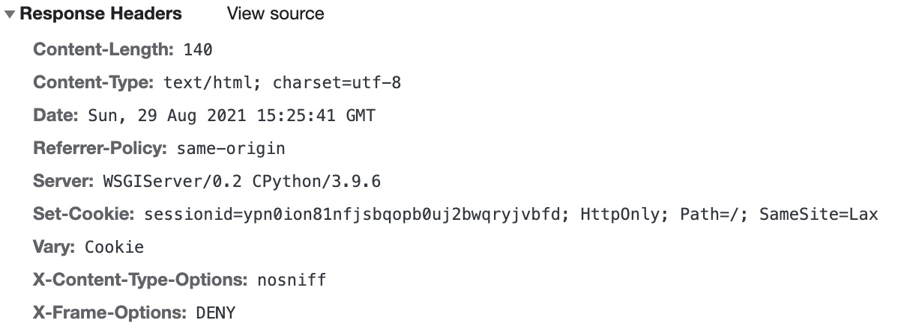

Django sessions
===============

Django's sessions support is one the load-bearing structures in Django. Almost every Django project you will be
involved in will likely involve Django's session support. In fact when you invoke ``django-admin startproject`` the
default ``settings.py`` file will have Django sessions autoconfigured. You will find it in

.. code-block:: python

   INSTALLED_APPS = [
       .
       .
       .
       'django.contrib.sessions',
       .
       .
       .
   ]
   MIDDLEWARE = [
    .
    .
    .
    'django.contrib.sessions.middleware.SessionMiddleware',
    .
    .
    .
 ]

As you can see Django sessions is autoincluded in ``INSTALLED_APPS`` and in ``MIDDLEWARE``. I recommend reading through
the source code for ``SessionMiddleware`` but not just yet. But before we can understand Django sessions, what
constitutes a session? To quote `MDN <https://developer.mozilla.org/en-US/docs/Web/HTTP/Session>`_
In client-server protocols, like HTTP, sessions consist of three phases:

1. The client establishes a TCP connection (or the appropriate connection if the transport layer is not TCP).
2. The client sends its request, and waits for the answer.
3. The server processes the request, sending back its answer, providing a status code and appropriate data.

Thus, it a user's interaction with your website or API server that constitutes a session. As such, the session could be
through a browser or an app (or another web service but we will not concern ourselves with that).
Note that I never claimed that a user had to authenticate himself/herself to the website to establish a session.
Just interaction is enough. Django's idea of a session is slightly different. It sees a session as starting when it
*begins* to track client interaction with the server. It does nothing to track interactions by default, I must note.
Look at the following request/response HTTP headers below

Now give Django a *reason* to establish a session. You can do that by adding the following line of code to any Django
view (before it returns)

.. code-block:: python

 request.session.set_expiry(0)

Now if you were to use the browser to refresh the view you will see that the HTTP response header will have changed to
the one captured below. This

See where it says ``Set-Cookie: sessionid=ypn0ion81nfjsbqopb0uj2bwqryjvbfd; HttpOnly; Path=/; SameSite=Lax``

That `sessionid` is the beginning of Django starting to track the user session. All it took was poking the session
hornet by calling ``request.session.set_expiry(0)``. what's more, now that the session is set, it will remain there.
What happens behind the scenes is that Django creates a `Session` object and puts it into the database (DB).
I have ``ipython`` installed in my virtual environment so ``django-admin manage.py shell`` brings up ``ipython``

::

    Python 3.9.6 (default, Jul  4 2021, 11:47:56)
    Type 'copyright', 'credits' or 'license' for more information
    IPython 7.26.0 -- An enhanced Interactive Python. Type '?' for help.

    In [1]: from django.contrib.sessions.models import Session

    In [2]: Session.objects.all()
    Out[2]: <QuerySet [<Session: ypn0ion81nfjsbqopb0uj2bwqryjvbfd>]>

It is possible to specify a different DB for Session model objects or use a key-value cache such as Memcached or Redis
but I digress.

Here are a few factoids about sessions that are obvious to most but not to some (and I have seen some bizarre code by
those who are oblivious):

#. As you might have guessed, the ``sessionid`` you see in the cookies section is has a value that is used as the primary key for the ``Session`` object in the DB.
#. A returning client is identified by the ``sessionid`` cookie. If the client resets the cookie, Django will think it is a new client interating with it and will potentially assign it a new ``sessionid`` cookie and create a new ``Session`` object in the DB. I say potentially because as I said earlier, Django needs a reason to be assigned a cookie.
#. Django sessions are server-based. They are not set on a per-view basis or a per-app basis (by which I mean a Django app as will be listed in ``INSTALLED_APPS`` in ``settings.py``). If the client visits say a view that has been mapped to a relative URL ``/hello/world`` on a server and then it visits a different view that maps on to the relative URL ``/hello/world2`` on the same server, the ``sessionid`` cookie remains unchanged.
#. Session objects have an age associated with them. It is governed by ``SESSION_COOKIE_AGE`` variable in ``settings.py`` It defaults to 2 weeks. The expiration age is expressed in number of seconds. If the there is no activity between the client and server for that many seconds, the session is considered stale and all data on the server associated with that sessionid will be marked unusable (we will expand on this in the subsequent section)
#. One thing Django never explicitly states - and I feel it ought to do so - is that the session cookie expiration resets everytime a client re-interacts with the server.
#. Django sessions survive server restarts. This is because they the ``Session`` objects are persisted either to cache or DB.

Session expiration reset
------------------------

To demonstrate how session expiration is reset everytime a new request comes to Django, create the following setup:

create Django template view with the following template

.. code-block:: python

    class HelloWorldView(TemplateView):
        template_name = 'helloworld.html'

        def get(self, request: HttpRequest, *args, **kwargs):
            counter = request.session.get('counter', 0)
            request.session['counter'] = counter + 1
            context = {'counter': counter}
            return render(request, self.template_name, context)

with the ``helloworld.html`` template file as below:

.. code-block:: html

    <!DOCTYPE html>
    <html lang="en">
    <head>
        <meta charset="UTF-8">
        <title>Hello World</title>
    </head>
    <body>
    Hello World  
    Counter : <b>{{counter}}</b>
    </body>
    </html>

Set ``SESSION_COOKIE_AGE`` to something manageable like 30 (secs) and we will use Chrome devtools to see the
``sessionid`` cookie. We will find that everytime you refresh the link for this view, the session expiry time will be
updated. If we wait for a period longer than ``SESSION_COOKIE_AGE`` (30 secs in this case), we should see the
``sessionid`` change. That's the trivial part. What does it matter in practice when a session expires and gets replaced
by a new session (or to be precise a new ``sessionid``)? What it means is that any data associated the session is
treated as being lost and you have to start from scratch. That's where the template view above can be useful as a
test setup.

We will keep refreshing the view every few seconds, say around every 5 seconds in the above example. The counter in the
template view will always start at 0 when the session is first established - there is no session data available for key
`'counter'` so the variable `counter` gets the default value 0 but from thereon, as long as the session is unexpired,
the counter will keep incrementing. If, however, the session expires - just wait more than 30 secs
between any two refreshes - you will see the counter reset to 0 because the older session gets marked as stale and
is replaced by a fresh session whihc also means the value of the key `'counter'` associated with the old session is
lost and the new session starts off like the old session: there is no value associated with the key `'counter'`.

